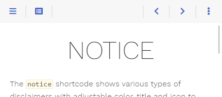
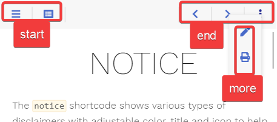

# Topbar

The theme comes with a reasonably configured topbar. You can learn how to [configure the defaults in this section](authoring/frontmatter/topbar).



Nevertheless, your requirements may differ from this configuration. Luckily, the theme has you covered as the topbar, its elements, and the functionality behind these elements are fully configurable by you.

> [!tip]
> All mentioned file names below can be clicked and show you the implementation for a better understanding.

## Areas

The default configuration comes with predefined areas that may contain an arbitrary set of elements.



- **start**: shown between menu and breadcrumb
- **middle**: shown between the _start_ and the _end_ area, taking the remaining space; contains the breadcrumb
- **end**: shown on the opposite breadcrumb side in comparison to the _start_ area
- **more**: shown when pressing the {}{} _more_ button in the topbar

While you cannot add additional areas in the topbar, you are free to [write additional area buttons](#defining-own-areas) that behave like the _more_ button, each providing a further user-defined area with its own option.

## Elements

Everything displayed in an area is an element. Most elements are buttons, but an element can display anything else.

The theme ships with the following predefined elements (from left to right in the screenshot). Each is identified by its type:

- {}{} [**sidebarbutton**](https://github.com/McShelby/hugo-theme-relearn/blob/main/layouts/partials/topbar/element/sidebarbutton.html): opens the sidebar flyout if in mobile layout
- {}{} [**tocbutton**](https://github.com/McShelby/hugo-theme-relearn/blob/main/layouts/partials/topbar/element/tocbutton.html): [opens the table of contents in an overlay](authoring/frontmatter/topbar#table-of-contents)
- {}{} [**breadcrumbs**](https://github.com/McShelby/hugo-theme-relearn/blob/main/layouts/partials/topbar/element/breadcrumbs.html): the [breadcrumb](authoring/frontmatter/topbar#breadcrumbs) of the page, or its title if the breadcrumb is disabled
- {}{} [**editbutton**](https://github.com/McShelby/hugo-theme-relearn/blob/main/layouts/partials/topbar/element/editbutton.html): browses to the editable page if the `editURL` [parameter is set](authoring/frontmatter/topbar#edit-button)
- {}{} [**sourcebutton**](https://github.com/McShelby/hugo-theme-relearn/blob/main/layouts/partials/topbar/element/sourcebutton.html): shows the page's source code if [source support](configuration/sitemanagement/outputformats#source-support) was activated
- {}{} [**markdownbutton**](https://github.com/McShelby/hugo-theme-relearn/blob/main/layouts/partials/topbar/element/markdownbutton.html): shows the page's markdown source if [markdown support](configuration/sitemanagement/outputformats#markdown-support) was activated
- {}{} [**printbutton**](https://github.com/McShelby/hugo-theme-relearn/blob/main/layouts/partials/topbar/element/printbutton.html): browses to the chapter's printable page if [print support](configuration/sitemanagement/outputformats#print-support) was activated
- {}{} [**prevbutton**](https://github.com/McShelby/hugo-theme-relearn/blob/main/layouts/partials/topbar/element/prevbutton.html): browses to the [previous page](authoring/frontmatter/topbar#arrow-navigation) if there is one
- {}{} [**nextbutton**](https://github.com/McShelby/hugo-theme-relearn/blob/main/layouts/partials/topbar/element/nextbutton.html): browses to the [next page](authoring/frontmatter/topbar#arrow-navigation) if there is one
- {}{} [**morebutton**](https://github.com/McShelby/hugo-theme-relearn/blob/main/layouts/partials/topbar/element/morebutton.html): opens the overlay for the _more_ area

Not all elements are displayed at every given time. This is configurable (see below if interested).

## Defining Topbar Elements

{}Option{} {}Front Matter{} The elements are defined for each area of the topbar:

- `topbarstart`: the _start_ area
- `topbarmiddle`: the _middle_ area
- `topbarend`: the _end_ area
- `topbarmore`: the _more_ area

As these options are arrays, you can define as many elements as you like in each area. The elements are displayed in the given order. Each element is identified by its `type` and may be given further parameters, depending on the element.

If you don't set these options in your `hugo.toml`, the theme defaults to the following configuration. The _more_ area is empty by default; some elements are moved there depending on the screen width.


topbarstart = [
  { type = 'sidebarbutton' },
  { type = 'tocbutton' }
]

topbarmiddle = [
  { type = 'breadcrumbs' }
]

topbarend = [
  { type = 'editbutton' },
  { type = 'sourcebutton' },
  { type = 'markdownbutton' },
  { type = 'printbutton' },
  { type = 'prevbutton' },
  { type = 'nextbutton' },
  { type = 'morebutton' }
]

topbarmore = []


> [!note]
> If you want to reconfigure an area, you have to copy over every element from the default configuration you want to keep, as reconfiguration will reset all elements of that area.

### Example

The following example

- removes all elements but the _more_ button from the _end_ area
- displays the _more_ button even if its overlay is empty by setting its `onempty` parameter to `disable`
- puts the _print_ button into the _more_ area on all screen widths


topbarend = [
  { type = 'morebutton', onempty = 'disable' }
]
topbarmore = [
  { type = 'printbutton' }
]


## Redefining Topbar Elements for Certain Pages

Suppose you are building a site that contains a topmost `log` section.

When the user is on one of the log pages, the topbar should not offer to edit the page, and the _print_ button should be tucked away in the _more_ area. All other pages should keep the [default elements](#defining-topbar-elements).

Directory structure:

````tree
- content | folder
  - log | folder
    - first-day.md | fa-fw fab fa-markdown | secondary
    - second-day.md | fa-fw fab fa-markdown | secondary
    - third-day.md | fa-fw fab fa-markdown | secondary
    - _index.md | fa-fw fab fa-markdown | secondary
  - _index.md | fa-fw fab fa-markdown | secondary
````

{}Option{} {}Front Matter{} Using [Hugo's cascade feature](https://gohugo.io/content-management/front-matter/#cascade), we can redefine the elements once in `log/_index.md` setting `topbarend` and `topbarmore` so they will be used in all children pages.

Setting the `topbarend` Front Matter will overwrite all default elements of the _end_ area. If you want to display the arrow navigation and the _more_ button as well like in this example, you have to declare them with the Front Matter as given in the [default options](#defining-topbar-elements). The _start_ area is not redefined and keeps its elements.


title = "Captain's Log"
[[cascade]]
  [cascade.params]
    topbarend = [
      { type = 'prevbutton' },
      { type = 'nextbutton' },
      { type = 'morebutton' },
    ]
    topbarmore = [
      { type = 'printbutton' },
    ]



## Defining Own Elements

Besides the predefined elements, you can write your own. Store its template in `layouts/partials/topbar/element/<TYPE>.html` of your site and add it with `{ type = '<TYPE>' }` to one of the topbar areas.

Your template receives every parameter of its configuration, and additionally the displayed page as `page`.

The topbar manages what the [button](#button) function writes: it shows, hides and moves it depending on the screen width. So use this function to display your element, even if it is not a plain button, putting what you want to show into the content of the button.

````go {title="layouts/partials/topbar/element/homebutton.html"}
{{- with .page }}
  {{- partial "topbar/func/button.html" (dict
    "page" .
    "class" "topbar-button-home"
    "href" (partial "permalink.gotmpl" (dict "to" site.Home))
    "icon" "home"
    "hint" "Home"
  )}}
{{- end }}
````

## Defining Own Areas

The _more_ area is nothing special: the [_more_ button](https://github.com/McShelby/hugo-theme-relearn/blob/main/layouts/partials/topbar/element/morebutton.html) opens it by calling the [area-button](#area-button) function with the area name `more`, and the option `topbarmore` fills it.

You can add further areas the same way. Write your own element calling the area-button function with an area name `<AREA>`. Its area is filled by the option `topbar<AREA>`, which is configured like the options of the predefined areas and can be set in the front matter as well.

````go {title="layouts/partials/topbar/element/toolsbutton.html"}
{{- partial "topbar/func/area-button.html" (dict
  "page" .page
  "area" "tools"
  "icon" "wrench"
  "hint" (T "Tools-action")
  "onempty" "hide"
)}}
````


topbarend = [
  { type = 'toolsbutton' }
]
topbartools = [
  { type = 'printbutton' }
]


As your template is free to call Hugo's `T` function, the tooltip is taken from your translation files.


[Tools-action]
other = "Tools"


Other elements can be moved into your area depending on the screen width with the `area-tools` [action](#screen-widths-and-actions).

### Button Types

The theme distinguishes between two types of buttons:

- [**button**](#button): a clickable button that either browses to another site, triggers a user-defined script or opens an overlay containing user-defined content
- [**area-button**](#area-button): the template for the {}{} _more_ button, to define your own area overlay buttons

### Element Parameters

#### Screen Widths and Actions

Depending on the screen width, you can configure how a button should behave. This applies to every element written by the [button](#button) or [area-button](#area-button) function, but not to other elements like the _breadcrumbs_, which always stay in their area. Screen width is divided into three classes:

- **s**: (controlled by the `onwidths` parameter) small (mobile) layout where the menu sidebar is hidden
- **m**: (controlled by the `onwidthm` parameter) medium desktop layout with visible sidebar while the content area width still resizes
- **l**: (controlled by the `onwidthl` parameter) large desktop layout with visible sidebar once the content area reached its maximum width

For each width class, you can configure one of the following actions:

- `show`: the button is displayed in its given area
- `hide`: the button is removed
- `area-XXX`: the button is moved from its given area into the area `XXX`; for example, this is used to move buttons to the _more_ area overlay in the mobile layout

#### Hiding and Disabling Stuff

While hiding an element depending on the screen size can be configured with the above-described _hide_ action, you may want to hide the element on certain other conditions as well.

For example, the _print_ button in its default configuration should only be displayed if print support was configured. This is done in your element template by checking the conditions first before displaying the element (see [`layouts/partials/topbar/element/printbutton.html`](https://github.com/McShelby/hugo-theme-relearn/blob/main/layouts/partials/topbar/element/printbutton.html)).

Another preferred condition for hiding a button is if the displayed overlay is empty. This is the case for the _toc_ (see [`layouts/partials/topbar/element/tocbutton.html`](https://github.com/McShelby/hugo-theme-relearn/blob/main/layouts/partials/topbar/element/tocbutton.html)) as well as the _more_ button and controlled by the parameter `onempty`.

This parameter can have one of the following values:

- `disable`: the button is displayed in a disabled state if the overlay is empty
- `hide`: the button is removed if the overlay is empty

If you want to disable a button containing _no overlay_, this can be achieved by an empty `href` parameter. An example can be seen in the _prev_ button (see `layouts/partials/topbar/element/prevbutton.html`) where the URL for the previous site may be empty.

## Reference

### Predefined Elements

The predefined button elements by the theme (all predefined elements besides the _breadcrumbs_, _tocbutton_ and _morebutton_). The _breadcrumbs_ element has no parameters besides its **type**.

The _&lt;varying&gt;_ parameter values are different for each element and configured for standard behavior as seen on this page.

| Name                  | Default           | Notes       |
|-----------------------|-------------------|-------------|
| **type**              | _&lt;empty&gt;_   | Mandatory type of the element. |
| **onwidths**          | _&lt;varying&gt;_ | The action that should be executed if the site is displayed in the given width:<br><br>- `show`: The element is displayed in its given area<br>- `hide`: The element is removed.<br>- `area-XXX`: The element is moved from its given area into the area `XXX`. |
| **onwidthm**          | _&lt;varying&gt;_ | See above. |
| **onwidthl**          | _&lt;varying&gt;_ | See above. |

### Predefined Overlay Elements

The predefined elements by the theme that open an overlay (the _tocbutton_ and _morebutton_).

The _&lt;varying&gt;_ parameter values are different for each element and configured for standard behavior as seen on this page.

| Name                  | Default           | Notes       |
|-----------------------|-------------------|-------------|
| **type**              | _&lt;empty&gt;_   | Mandatory type of the element. |
| **onempty**           | `hide`            | Defines what to do with the button if the content overlay is empty:<br><br>- `disable`: The button is displayed in a disabled state.<br>- `hide`: The button is removed. |
| **onwidths**          | _&lt;varying&gt;_ | The action that should be executed if the site is displayed in the given width:<br><br>- `show`: The element is displayed in its given area<br>- `hide`: The element is removed.<br>- `area-XXX`: The element is moved from its given area into the area `XXX`. |
| **onwidthm**          | _&lt;varying&gt;_ | See above. |
| **onwidthl**          | _&lt;varying&gt;_ | See above. |

### Button

Contains the basic button functionality and is used as a base implementation for all predefined button elements ([`layouts/partials/topbar/func/button.html`](https://github.com/McShelby/hugo-theme-relearn/blob/main/layouts/partials/topbar/func/button.html)).

Call this from your own element templates if you want to implement a button without an overlay like the _print_ button ([`layouts/partials/topbar/element/printbutton.html`](https://github.com/McShelby/hugo-theme-relearn/blob/main/layouts/partials/topbar/element/printbutton.html)) or with an overlay containing arbitrary content like the _toc_ button ([`layouts/partials/topbar/element/tocbutton.html`](https://github.com/McShelby/hugo-theme-relearn/blob/main/layouts/partials/topbar/element/tocbutton.html)).

For displaying an area in the button's overlay, see [Area-Button](#area-button).

#### Parameters

| Name                  | Default         | Notes       |
|-----------------------|-----------------|-------------|
| **page**              | _&lt;empty&gt;_ | Mandatory reference to the page. |
| **class**             | _&lt;empty&gt;_ | Mandatory unique class name for this button. Displaying two buttons with the same value for **class** is undefined. |
| **href**              | _&lt;empty&gt;_ | Either the destination URL for the button or JavaScript code to be executed on click.<br><br>- If starting with `javascript:` all following text will be executed in your browser<br>- Every other string will be interpreted as URL<br>- If empty and no **action** is set, the button will be displayed in a disabled state regardless of its **content** |
| **action**            | _&lt;empty&gt;_ | Name of the action to execute on click, handled by a script instead of inline JavaScript, so it works with a strict [Content Security Policy](https://developer.mozilla.org/en-US/docs/Web/HTTP/Guides/CSP). If set, **href** is not needed.<br><br>- `toggle-flyout`: shows or hides the content overlay<br>- `toggle-nav`: shows or hides the sidebar menu<br>- any other name: execute your own code, see the [button shortcode](shortcodes/button#button-with-own-action) |
| **istoggle**          | `false`         | If `true`, the button announces to assistive technology that it shows and hides something. Set it if your **action** is `toggle-flyout` or `toggle-nav`. For your own action, see the [button shortcode](shortcodes/button#toggle-button). |
| **icon**              | _&lt;empty&gt;_ | [Font Awesome icon name](shortcodes/icon#finding-an-icon). |
| **onempty**           | `disable`       | Defines what to do with the button if the content parameter was set but ends up empty:<br><br>- `disable`: The button is displayed in a disabled state.<br>- `hide`: The button is removed. |
| **onwidths**          | `show`          | The action that should be executed if the site is displayed in the given width:<br><br>- `show`: The button is displayed in its given area<br>- `hide`: The button is removed.<br>- `area-XXX`: The button is moved from its given area into the area `XXX`. |
| **onwidthm**          | `show`          | See above. |
| **onwidthl**          | `show`          | See above. |
| **hint**              | _&lt;empty&gt;_ | Arbitrary text displayed in the tooltip. |
| **title**             | _&lt;empty&gt;_ | Arbitrary text for the button. |
| **content**           | _&lt;empty&gt;_ | Arbitrary HTML to put into the content overlay. This parameter may be empty. In this case, no overlay will be generated. |

### Area-Button

Contains the basic functionality to display area overlay buttons ([`layouts/partials/topbar/func/area-button.html`](https://github.com/McShelby/hugo-theme-relearn/blob/main/layouts/partials/topbar/func/area-button.html)).

Call this from your own element templates if you want to implement a button with an area overlay like the _more_ button ([`layouts/partials/topbar/element/morebutton.html`](https://github.com/McShelby/hugo-theme-relearn/blob/main/layouts/partials/topbar/element/morebutton.html)), see [Defining Own Areas](#defining-own-areas).

#### Parameters

| Name                  | Default         | Notes       |
|-----------------------|-----------------|-------------|
| **page**              | _&lt;empty&gt;_ | Mandatory reference to the page. |
| **area**              | _&lt;empty&gt;_ | Mandatory unique area name for this area. Displaying two areas with the same value for **area** is undefined. The area is filled by the option `topbar<AREA>`. |
| **icon**              | _&lt;empty&gt;_ | [Font Awesome icon name](shortcodes/icon#finding-an-icon). |
| **onempty**           | `disable`       | Defines what to do with the button if the content overlay is empty:<br><br>- `disable`: The button is displayed in a disabled state.<br>- `hide`: The button is removed. |
| **onwidths**          | `show`          | The action that should be executed if the site is displayed in the given width:<br><br>- `show`: The button is displayed in its given area<br>- `hide`: The button is removed.<br>- `area-XXX`: The button is moved from its given area into the area `XXX`. |
| **onwidthm**          | `show`          | See above. |
| **onwidthl**          | `show`          | See above. |
| **hint**              | _&lt;empty&gt;_ | Arbitrary text displayed in the tooltip. |
| **title**             | _&lt;empty&gt;_ | Arbitrary text for the button. |

## Migration for Relearn 9

Previously, the content of an area was defined by a template in `layouts/partials/topbar/area` that you had to override in your site to change it, calling button templates from `layouts/partials/topbar/button`. Now the areas are [configured by options](#defining-topbar-elements), the same way as the [sidebar menus](configuration/sidebar/menus#defining-sidebar-menus), listing elements stored in `layouts/partials/topbar/element`.

Your templates are still honored. If the theme finds an area template, it defines the area and takes precedence over the options. The theme's button templates can still be called from it. In both cases your build will give you a deprecation warning naming the file. Start to migrate early, as this will be removed with the next major update of the theme.

### Predefined Areas

If you have overridden `start.html`, `end.html` or `more.html` in `layouts/partials/topbar/area`, turn each call of a button template into an entry of the option named after the area and delete the file.

| Legacy Template                           | New Option    |
| ----------------------------------------- | ------------- |
| `layouts/partials/topbar/area/start.html` | `topbarstart` |
| `layouts/partials/topbar/area/end.html`   | `topbarend`   |
| `layouts/partials/topbar/area/more.html`  | `topbarmore`  |

The button template becomes the `type` of the entry according to the following table. Every parameter besides `page` is carried over unchanged.

| Legacy Template              | New Type         |
| ---------------------------- | ---------------- |
| `topbar/button/sidebar.html` | `sidebarbutton`  |
| `topbar/button/toc.html`     | `tocbutton`      |
| `topbar/button/edit.html`    | `editbutton`     |
| `topbar/button/source.html`  | `sourcebutton`   |
| `topbar/button/markdown.html`| `markdownbutton` |
| `topbar/button/print.html`   | `printbutton`    |
| `topbar/button/prev.html`    | `prevbutton`     |
| `topbar/button/next.html`    | `nextbutton`     |
| `topbar/button/more.html`    | `morebutton`     |

For example, this template

````go {title="layouts/partials/topbar/area/end.html"}
{{ partial "topbar/button/print.html" (dict
  "page" .
)}}
{{ partial "topbar/button/more.html" (dict
  "page" .
  "onempty" "disable"
)}}
````

becomes


topbarend = [
  { type = 'printbutton' },
  { type = 'morebutton', onempty = 'disable' }
]


If your template showed different buttons depending on the page, set the option in the front matter of these pages instead.

### Own Buttons

Move your button templates from `layouts/partials/topbar/button` to `layouts/partials/topbar/element`. Once the area template calling them is deleted, list them in the option by their file name. The templates themselves don't need to be changed.

An element now receives all parameters of its entry and the displayed page as `page`, where your button previously received what your area template passed to it.

### Overridden Buttons

If you have overridden one of the theme's button templates in `layouts/partials/topbar/button`, your version is only used by your own area templates. The configured elements don't know of it.

Move it to `layouts/partials/topbar/element`, renaming it according to the table above.

### Own Areas

If you have written your own button calling [`topbar/func/area-button.html`](#area-button) together with a template `layouts/partials/topbar/area/<AREA>.html` for its content, move your button to `layouts/partials/topbar/element` like your [other buttons](#own-buttons) and replace the area template by the [option of its area](#defining-own-areas).

For example, these templates

````go {title="layouts/partials/topbar/button/toolsbutton.html"}
{{ partial "topbar/func/area-button.html" (dict
  "page" .page
  "area" "tools"
  "icon" "wrench"
)}}
````

````go {title="layouts/partials/topbar/area/tools.html"}
{{ partial "topbar/button/print.html" (dict
  "page" .
)}}
````

become the unchanged button template moved to `layouts/partials/topbar/element/toolsbutton.html` and


topbarend = [
  { type = 'toolsbutton' }
]
topbartools = [
  { type = 'printbutton' }
]

