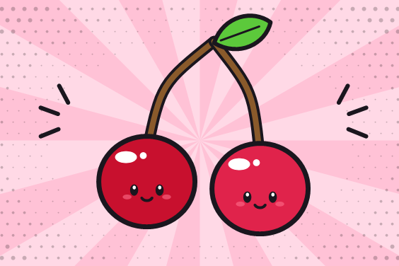

+++
date = '2021-03-20'
description = 'A sour demo page, still a draft'
tags = ['fruits', 'non-hidden']
title = 'Cherry'
weight = 30

[params]
  flavor = 'sour'
  priority = 2
  status = 'draft'
+++

This is a demo page for the `pages` shortcode.
