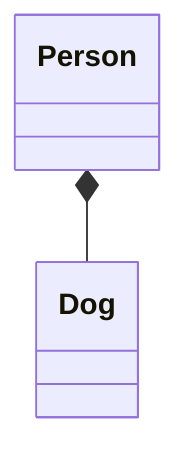
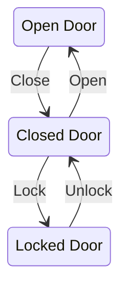

+++
description = "Generation of diagram and flowchart from text in a similar manner as Markdown"
title = "Mermaid"
+++

[Mermaid](https://mermaidjs.github.io/) is a library helping you to generate diagram and flowcharts from text, in a similar manner as Markdown.

{}
This only works in modern browsers.
{}

{}
Due to limitations with [Mermaid](https://github.com/mermaid-js/mermaid/issues/1846), it is currently not possible to use Mermaid code fences in an initially collapsed `expand` shortcode. This is a know issue and [can't be fixed by this theme](https://github.com/McShelby/hugo-theme-relearn/issues/187).
{}

## Usage

Just insert your Mermaid code in the `mermaid` shortcode like this:

````go

classDiagram
    Person *-- Dog

````

You can set an optional `align` attribute which defaults to `"center"`.

If you don't need alignment you can use the alternative syntax using code fences if you have turned off `guessSyntax` for the `markup.highlight` setting (see below):

````plaintext

````

The generated graphs can be be panned by dragging them and zoomed by using the mousewheel. On mobile devices you can use finger gestures.

## Examples

### Flowchart


%%{init:{"theme":"forest"}}%%
graph LR;
    A[Hard edge] -->|Link text| B(Round edge)
    B --> C{<strong>Decision</strong>}
    C -->|One| D[Result one]
    C -->|Two| E[Result two]


{}
````go

%%{init:{"theme":"forest"}}%%
graph LR;
    A[Hard edge] -->|Link text| B(Round edge)
    B --> C{<strong>Decision</strong>}
    C -->|One| D[Result one]
    C -->|Two| E[Result two]

````
{}

### Sequence


sequenceDiagram
    participant Alice
    participant Bob
    Alice->>John: Hello John, how are you?
    loop Healthcheck
        John->John: Fight against hypochondria
    end
    Note right of John: Rational thoughts <br/>prevail...
    John-->Alice: Great!
    John->Bob: How about you?
    Bob-->John: Jolly good!


{}
````go

sequenceDiagram
    participant Alice
    participant Bob
    Alice->>John: Hello John, how are you?
    loop Healthcheck
        John->John: Fight against hypochondria
    end
    Note right of John: Rational thoughts <br/>prevail...
    John-->Alice: Great!
    John->Bob: How about you?
    Bob-->John: Jolly good!

````
{}

### GANTT


gantt
        dateFormat  YYYY-MM-DD
        title Adding GANTT diagram functionality to Mermaid
        section A section
        Completed task            :done,    des1, 2014-01-06,2014-01-08
        Active task               :active,  des2, 2014-01-09, 3d
        Future task               :         des3, after des2, 5d
        Future task2              :         des4, after des3, 5d
        section Critical tasks
        Completed task in the critical line :crit, done, 2014-01-06,24h
        Implement parser and jison          :crit, done, after des1, 2d
        Create tests for parser             :crit, active, 3d
        Future task in critical line        :crit, 5d
        Create tests for renderer           :2d
        Add to Mermaid                      :1d


{}
````go

gantt
        dateFormat  YYYY-MM-DD
        title Adding GANTT diagram functionality to Mermaid
        section A section
        Completed task            :done,    des1, 2014-01-06,2014-01-08
        Active task               :active,  des2, 2014-01-09, 3d
        Future task               :         des3, after des2, 5d
        Future task2              :         des4, after des3, 5d
        section Critical tasks
        Completed task in the critical line :crit, done, 2014-01-06,24h
        Implement parser and jison          :crit, done, after des1, 2d
        Create tests for parser             :crit, active, 3d
        Future task in critical line        :crit, 5d
        Create tests for renderer           :2d
        Add to Mermaid                      :1d

````
{}

### Class


classDiagram
  Class01 <|-- AveryLongClass : Cool
  Class03 *-- Class04
  Class05 o-- Class06
  Class07 .. Class08
  Class09 --> C2 : Where am i?
  Class09 --* C3
  Class09 --|> Class07
  Class07 : equals()
  Class07 : Object[] elementData
  Class01 : size()
  Class01 : int chimp
  Class01 : int gorilla
  Class08 <--> C2: Cool label


{}
````go

classDiagram
    Class01 <|-- AveryLongClass : Cool
    Class03 *-- Class04
    Class05 o-- Class06
    Class07 .. Class08
    Class09 --> C2 : Where am i?
    Class09 --* C3
    Class09 --|> Class07
    Class07 : equals()
    Class07 : Object[] elementData
    Class01 : size()
    Class01 : int chimp
    Class01 : int gorilla
    Class08 <--> C2: Cool label

````
{}

### State

````mermaid
stateDiagram-v2
  open: Open Door
  closed: Closed Door
  locked: Locked Door
  open   --> closed: Close
  closed --> locked: Lock
  locked --> closed: Unlock
  closed --> open: Open
````

{}
````go

````
{}

## Configuration

Mermaid is configured with default settings. You can customize Mermaid's default settings for all of your files thru a JSON object in your `config.toml`, override these settings per page thru your pages frontmatter or override these setting per diagramm thru [diagram directives](https://mermaid-js.github.io/mermaid/#/directives?id=directives).

The JSON object of your `config.toml` / frontmatter is forwarded into Mermaid's `mermaid.initialize()` function.

See [Mermaid documentation](http://mermaid-js.github.io/mermaid/#/Setup?id=mermaidapi-configuration-defaults) for all allowed settings.

The `theme` setting can also be set by your used color variant. This will be the sitewide default and can - again - be overridden by your settings in `config.toml`, frontmatter or diagram directives.

{}
If you want to use mermaid codefences, you have to turn off `guessSyntax` for the `markup.highlight` setting.
{}

### Example

````toml
[params]
  mermaidInitialize = "{ \"theme\": \"dark\" }"

[markup]
  [markup.highlight]
    # if set to `guessSyntax = true`, there will be no unstyled code even if no language
    # was given BUT mermaid code fences will not work anymore! So this is a mandatory
    # setting for your site
    guessSyntax = false
````

or pages frontmatter
````toml
+++
mermaidInitialize = "{ \"theme\": \"dark\" }"
+++
````
