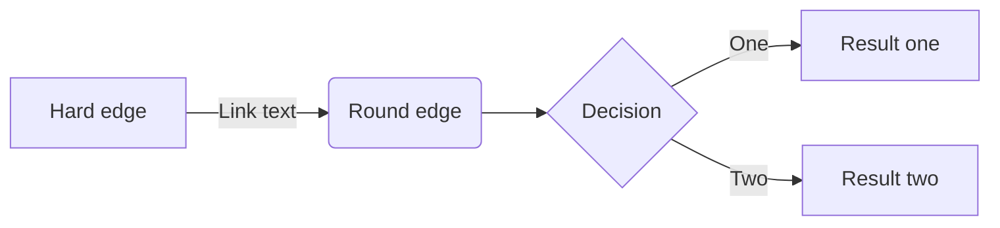

[Mermaid](https://mermaidjs.github.io/) is a library helping you to generate diagram and flowcharts from text, in a similar manner as Markdown.

Just insert your mermaid code in the `mermaid` shortcode and that's it.

## Examples

### Flowchart example

    
    graph LR;
        A[Hard edge] -->|Link text| B(Round edge)
        B --> C{<strong>Decision</strong>}
        C -->|One| D[Result one]
        C -->|Two| E[Result two]
    

renders as


graph LR;
    A[Hard edge] -->|Link text| B(Round edge)
    B --> C{<strong>Decision</strong>}
    C -->|One| D[Result one]
    C -->|Two| E[Result two]


or you can use this alternative syntax:

    ```mermaid
    graph LR;
        A[Hard edge] -->|Link text| B(Round edge)
        B --> C{Decision}
        C -->|One| D[Result one]
        C -->|Two| E[Result two]
    ```

renders as



## Sequence example

    
    sequenceDiagram
        participant Alice
        participant Bob
        Alice->>John: Hello John, how are you?
        loop Healthcheck
            John->John: Fight against hypochondria
        end
        Note right of John: Rational thoughts <br/>prevail...
        John-->Alice: Great!
        John->Bob: How about you?
        Bob-->John: Jolly good!
    

renders as


sequenceDiagram
    participant Alice
    participant Bob
    Alice->>John: Hello John, how are you?
    loop Healthcheck
        John->John: Fight against hypochondria
    end
    Note right of John: Rational thoughts <br/>prevail...
    John-->Alice: Great!
    John->Bob: How about you?
    Bob-->John: Jolly good!


### GANTT Example

    
    gantt
            dateFormat  YYYY-MM-DD
            title Adding GANTT diagram functionality to mermaid
            section A section
            Completed task            :done,    des1, 2014-01-06,2014-01-08
            Active task               :active,  des2, 2014-01-09, 3d
            Future task               :         des3, after des2, 5d
            Future task2               :         des4, after des3, 5d
            section Critical tasks
            Completed task in the critical line :crit, done, 2014-01-06,24h
            Implement parser and jison          :crit, done, after des1, 2d
            Create tests for parser             :crit, active, 3d
            Future task in critical line        :crit, 5d
            Create tests for renderer           :2d
            Add to mermaid                      :1d
    

renders as


gantt
        dateFormat  YYYY-MM-DD
        title Adding GANTT diagram functionality to mermaid
        section A section
        Completed task            :done,    des1, 2014-01-06,2014-01-08
        Active task               :active,  des2, 2014-01-09, 3d
        Future task               :         des3, after des2, 5d
        Future task2               :         des4, after des3, 5d
        section Critical tasks
        Completed task in the critical line :crit, done, 2014-01-06,24h
        Implement parser and jison          :crit, done, after des1, 2d
        Create tests for parser             :crit, active, 3d
        Future task in critical line        :crit, 5d
        Create tests for renderer           :2d
        Add to mermaid                      :1d


### Class example

    
    classDiagram
      Class01 <|-- AveryLongClass : Cool
      Class03 *-- Class04
      Class05 o-- Class06
      Class07 .. Class08
      Class09 --> C2 : Where am i?
      Class09 --* C3
      Class09 --|> Class07
      Class07 : equals()
      Class07 : Object[] elementData
      Class01 : size()
      Class01 : int chimp
      Class01 : int gorilla
      Class08 <--> C2: Cool label
    

renders as


classDiagram
  Class01 <|-- AveryLongClass : Cool
  Class03 *-- Class04
  Class05 o-- Class06
  Class07 .. Class08
  Class09 --> C2 : Where am i?
  Class09 --* C3
  Class09 --|> Class07
  Class07 : equals()
  Class07 : Object[] elementData
  Class01 : size()
  Class01 : int chimp
  Class01 : int gorilla
  Class08 <--> C2: Cool label


### State Diagrams

    
    stateDiagram-v2
      open: Open Door
      closed: Closed Door
      locked: Locked Door
      open   --> closed: Close
      closed --> locked: Lock
      locked --> closed: Unlock
      closed --> open: Open
    

renders as


stateDiagram-v2
  open: Open Door
  closed: Closed Door
  locked: Locked Door
  open   --> closed: Close
  closed --> locked: Lock
  locked --> closed: Unlock
  closed --> open: Open


## Configuration

Mermaid is configured with default settings. You can customize mermaids default settings for all of your files thru a JSON object in your `config.toml` or override these settings sidewise thru your pages frontmatter.

This JSON object is forwarded into mermaids `mermaid.initialize()` function.

See [mermaid documentation](http://mermaid-js.github.io/mermaid/getting-started/Setup.html#mermaidapi-configuration-defaults) for all allowed settings.

### Example

````toml
[params]
  mermaidInitialize = "{ \"theme\": \"dark\" }"
````

or pages frontmatter
````toml
+++
mermaidInitialize = "{ \"theme\": \"dark\" }"
+++
````
